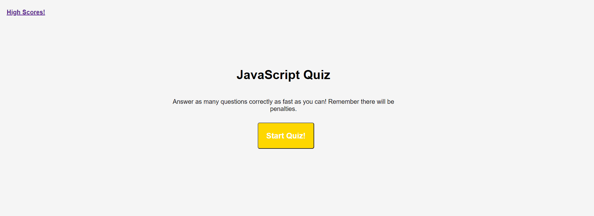

# HW4_Code_Quiz

### Overview
Create a timed coding quiz with multiple choices and scored board features using HTML, CSS and JavaScript.

### Implementation
* Separate pages for main and highscore page with HTML.
* Supporting CSS with responsive query.
* Separate logic, questions and scored board JavaScript.

[Code Quiz Webpage Link](https://kaidong-chr.github.io/HW4_Code_Quiz/)

### Demonstration

### Installation

Prefered application and version controlled system.
* Visual Studio Code - https://code.visualstudio.com/download
* Git - https://git-scm.com/downloads

### Contributing

To contribute clone from the repo.
You can also fork or download from the repo, if you prefer to view or edit this in your own space.

### Credits

* Trilogy Education Services
* W3Schools
* stackoverflow
* stackexchange

### License

Copyright © 2020 Kai Dong